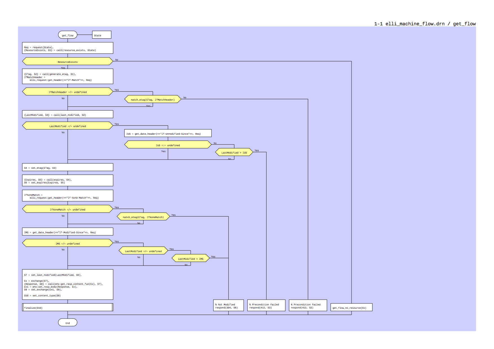

# Elli Machine

Elli Machine, another flavor of web(z)machine

*work in progress*

## Introduction

Elli Machine is a webmachine implementation on top of the Elli webserver. The main idea of Elli Machine is to have a higher level http api on top of a fast and modular http webserver. All header and body handling is done with binaries. Elli Machine does not do any logging, set server name headers, as this can be handled by specialized Elli middleware.

## Controllers

Controllers are modules with a set of functions which you can use to define the behaviour of your web service. Elli Machine takes care of the protocol handling. Controllers are similar to webmachine resources.

```erlang
init(Request, Args) -> {ok, Context} 
```

All controllers should define and export init/2, which will receive a configuration property list from the dispatcher as its argument. This function should, if successful, return {ok, Context}. Context is any term, and will be threaded through all of
the other Webmachine resource functions. 

```erlang
handle_event(Name, EventArgs, Context) -> ok.
```

All controllers should define and export handle_event/3, which will
receive events from the http decision core. This can be used during debugging or collection of statistics.

```erlang
render_error(Code, Error, ReqData, Context) -> {Html, ReqData, Context}
```

When Elli Machine encounters an error during processing of a request and a controller exports this function it will be used to render a html error message.

## Controller Function Signature

All controller functions are of the signature:

```erlang
f(ReqData, Context) -> {Result, ReqData, Context}
```

### Result

The rest of this document is about the effects produced by different
values in the Result term from different resource functions.

### Context

Context is an arbitrary term() that is specific to your
application. Elli Machine will never do anything with this term other
than threading it through the various functions of your resource. This
is the means by which transient application-specific request state is
passed along between functions.

### ReqData

ReqData is a #machine_reqdata{} term, and is manipulated via 
the emr interface. A controller function may access request data 
(such as header values) from the input value. If a resource function 
wishes to affect the response data in some way other than that implied 
by its return value (e.g. adding an X-Header) then it should modify 
the returned ReqData term accordingly.

### Resource Functions

There are over 30 controller functions you can define, but any of them
can be omitted as they have reasonable defaults. Each function is
described below, showing the default and allowed values that may be in
the `Result` term. The default will be used if a resource does not
export the function.

Any function which has no description is optional and the effect of
its return value should be evident from examining the [[Diagram]].

| Function | Default | Description |
| -------: | :------ | :---------- |
| `ping` | | Called at the start of handling a request, should return `pong`. Otherwise `503 Service Unavailable` will be returned to the client |
| `service_available` | `true` | Returns `503 Service Unvailable` when `false` is returned. |
| `resource_exists` | `true` | |
| `auth_required` | `true` | |
| `is_authorized` | `true` | |
| `forbidden` | `false` | |
| `upgrades_provided` | `[]` | |
| `allow_missing_post` | `false` | |
| `validate_content_md5` | `not_validated` | Validate the content-md5 header, when `not_validated` is returend elli_machine will check the content hash. When `false` is returned, `400 Bad Request` is sent back to the client, when something else is returned processing will continue. |
| `malformed_request` | `false` | |
| `uri_too_long` | `false` | |
| `known_content_type` | `true` | |
| `valid_content_headers` | `true` | |
| `valid_entity_length` | `true` | |
| `options` | `[]` | |
| `allowed_methods` | `[` `'GET'` , `'HEAD'` `]` | |
| `known_methods` | `[` `'GET'`, `'HEAD'`, `'POST'`, `'PUT'`, `'DELETE'`, `'TRACE'`, `'CONNECT'`, `'OPTIONS'` `]` | |
| `content_types_provided` | `[` `{` `<<"text/html">>`, `to_html` `}` `]` | |
| `content_types_accepted` | `[]` | |
| `delete_resource` | `false` | |
| `delete_completed` | `true` | |
| `post_is_create` | `false` | |
| `create_path` | `undefined` | |
| `base_uri` | `undefined` | |
| `process_post` | `no_default` | Returns `true` when the post is handled. It is also possible to return {redirect, path} then the post is handled and a `303 See Other` response is returned to the client. |
| `language_available` | `true` | |
| `charsets_provided` | `no_charset` | |
| `encodings_provided` | `[` `{` `<<"identity">>`, `fun(X) -> X end` `}` `]` | |
| `variances` | `[]` | |
| `is_conflict` | `false` | |
| `multiple_choices` | `false` | |
| `previously_existed` | `false` | |
| `moved_permanently` | `false` | |
| `moved_temporarily` | `false` | |
| `last_modified` | `undefined` | |
| `expires` | `undefined` | |
| `generate_etag` | `undefined` | |
| `finish_request` | `true` | |
[Controller Table][controller-table]

The above are all of the supported predefined controller functions. In
addition to whichever of these a controller wishes to use, it also must
export all of the functions named in the return values of the
`content_types_provided` and `content_types_accepted` functions.



